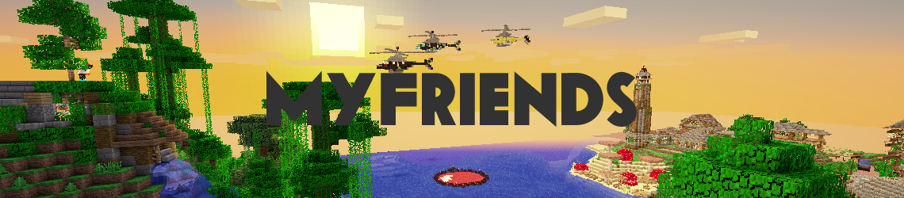
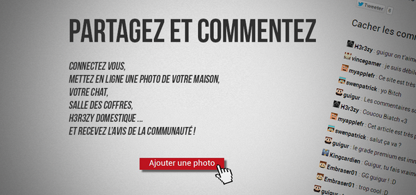

## Présentation

Myfriends2.fr est un ancien projet web de 2013-2014.
Celui-ci était le site internet du serveur Minecraft de MyAppleFr.
<!-- more -->

## Features

Il permettait entre autres de :

- S'inscrire avec une liaison au serveur (recevoir un code d'activation pour éviter de se faire voler son pseudo)
- Voir des news relatives au serveur.
- Poster des images sur le portfolio du serveur
- Poster des commentaires pour interagir aux articles et aux photos sur le portfolio
- Voir la dynmap du serveur
- D'acheter des items via la boutique (mais cette fonctionnalité n'a jamais été finie :/)

## Failles et problèmes de sécurité

Étant codé "from scratch", le site a souffert de quelques problèmes de sécurité...

Le problème le plus important étant l'utilisation de "mysql_connecy" et l'oubli de "msql_realescape" dans le login qui a résulté à des injections sql...

Le problème a rapidement été patché bien que le code du site soit vraiment bordélique.

Une tentative de recode du site a été entreprise pour le recoder toujours "from scratch" mais cette fois-ci en poo.

## Réception de la communauté

Le site a plutôt bien fonctionné, les visites étaient consistantes et la communauté a grandement apprécié celui-ci.

Quelques compagnes de "pub" ont été effectués via twitter et sur le serveur pour démocratiser le site.

## Rétrospective

Si aujourd'hui je devais refaire un chantier du même genre je pense que je serais ravi bien que Minecraft n'est plus vraiment mon jeu de prédilection.

Cependant, s'il y a bien une chose que je ferais différemment pour la création d'un nouveau projet, c'est bel et bien de me servir d'un framework comme Symfony par exemple. À la fois pour alléger le développent, mais aussi pour m'aider à structurer mon code de façon organisé, et bien sûr de m'assurer que le projet est moins susceptible aux diverses failles et omission niveau sécurité.

## Update 26/02/2018

Une backup du site est disponible ici --> [myfriends2.guigur.com](http://myfriends2.guigur.com/) <--
